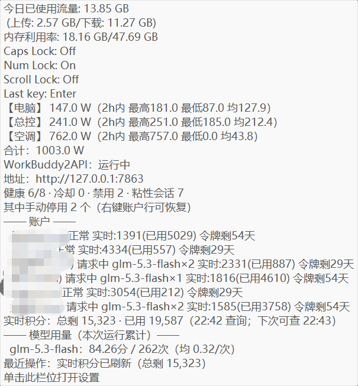
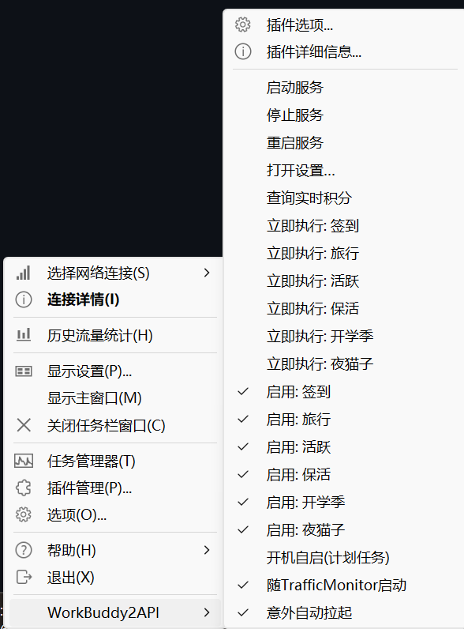
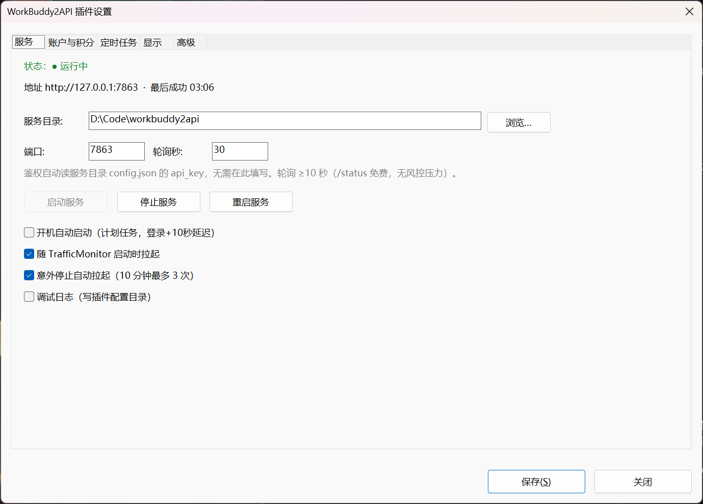
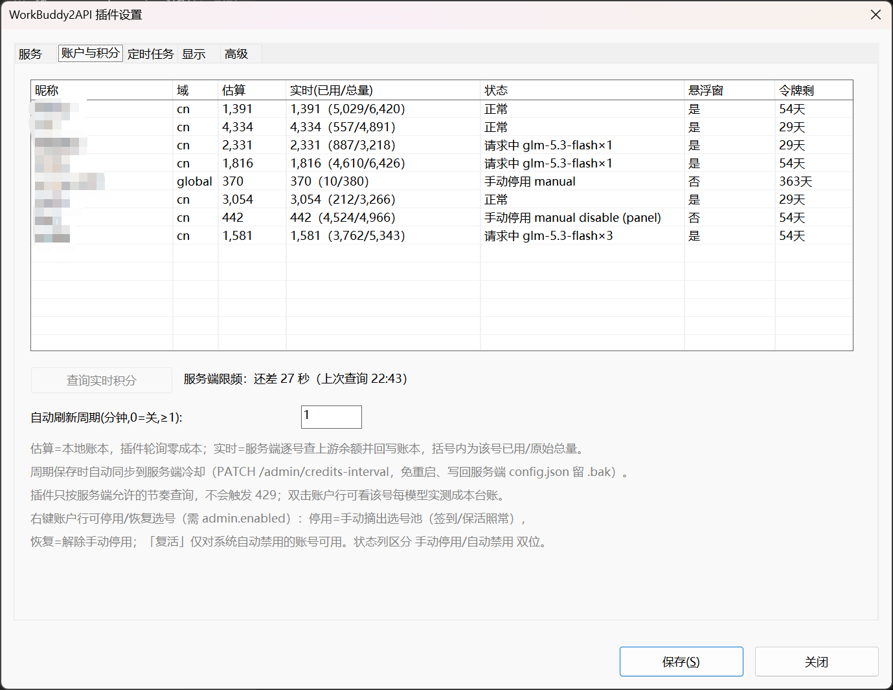
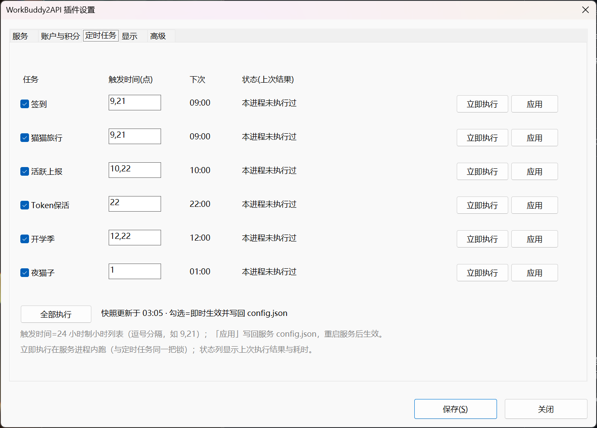
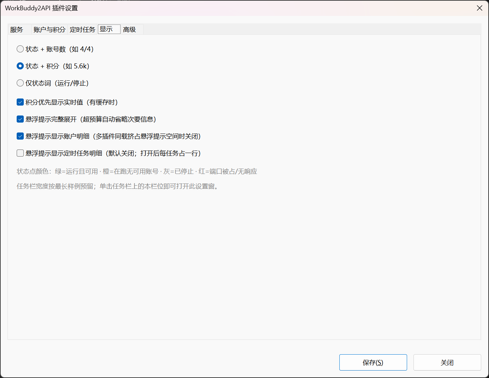
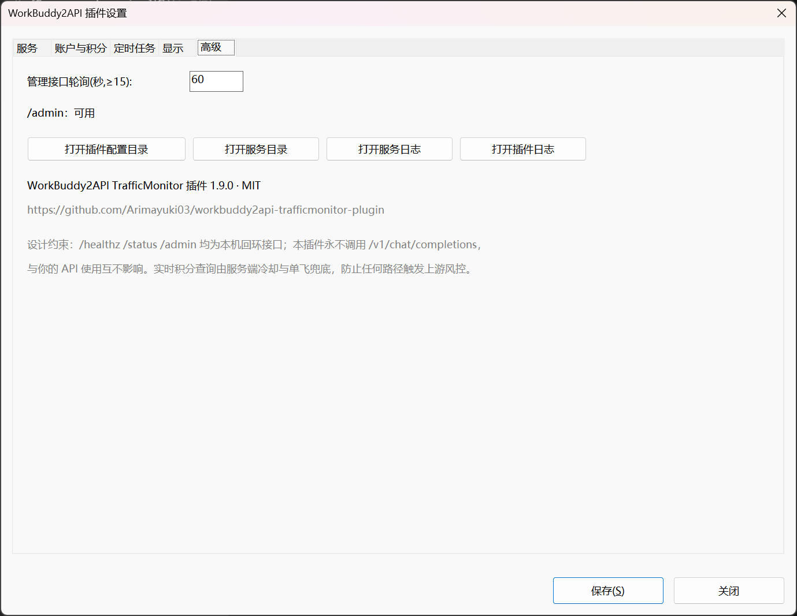

# TrafficMonitor WorkBuddy2API 插件

本仓库为 TrafficMonitor 制作的 workbuddy2api 服务监控插件（随带官方插件接口头 API v8，1.8.6 实测）。
需配合 [Arimayuki03/workbuddy2api](https://github.com/Arimayuki03/workbuddy2api)（含 `/admin` 接口的 fork）使用，详见"前置条件"。

## 组成

| 目录 | 说明 |
| --- | --- |
| `include/` | TrafficMonitor 官方 `PluginInterface.h`（API v8，vendored） |
| `third_party/` | nlohmann/json v3.11.3 单头文件（vendored） |
| `src/` | 插件源码（纯 Win32，不依赖 MFC；静态 CRT，产物单文件） |
| `res/` | 对话框资源 |
| `build/` | 编译脚本与工程文件 |
| `scripts/` | 部署脚本 |

## 前置条件（重要）

**本插件必须配合 [Arimayuki03/workbuddy2api](https://github.com/Arimayuki03/workbuddy2api) 使用**
——`/admin` 管理接口（任务开关/立即执行/实时积分/积分冷却热改）是该 fork 独有的，
官方上游 [Sliverkiss/workbuddy2api](https://github.com/Sliverkiss/workbuddy2api) 没有这些接口，
插件的"定时任务/实时积分"页会提示不可用，只能看服务状态与账户估算积分。

启用完整功能需在 workbuddy2api 的 `config.json` 增加并重启一次服务：

```json
"admin": { "enabled": true }
```

## 编译

```powershell
powershell -ExecutionPolicy Bypass -File build\build.ps1
```

输出 `build\out\Release\WorkBuddy2ApiPlugin.dll`。需 VS2022（含 C++ 桌面工作负载或 BuildTools）。

## 部署

```powershell
powershell -ExecutionPolicy Bypass -File scripts\deploy.ps1 -TMDir 'E:\软件\TrafficMonitor'
```

重启 TrafficMonitor（或在插件管理里重载），插件管理列表中会出现 **WorkBuddy2API**。
在"显示项目"里勾选 `WB2API 服务状态` 即出现在主窗口/任务栏窗口。
**栏位不显示时先查这里**：主窗口与任务栏窗口各有独立的显示项勾选（落盘在 TM 目录 config.ini 的
`plugin_display_item` 列表），插件加载正常 ≠ 已勾选显示。

## 使用

- **任务栏/主窗口**：彩点=服务状态，文本可配置为 `4/4`（健康/总数）、积分或纯状态；单击栏位打开设置。
- **设置（5 页）**：服务（目录/端口/启停/自启）、账户与积分（实时列含"剩余（已用/总量）"；
  状态列区分 冷却/熔断/降权(连败)/模型限额；**双击账户行**弹出该号每模型实测成本台账，
  每1k=实测千 token 均价、≤0 即免费，同 wb2api `status-report.ps1` 口径）、
  定时任务（勾选=热生效；触发时间可直接编辑并「应用」写回服务 config.json，重启服务后生效；
  立即执行=服务进程内触发）、显示、高级。
- **插件命令菜单**：启动/停止/重启、查询实时积分、立即执行/启用各类任务、三个开关。
- **成本台账**：设置窗页②**双击账户行**，弹出该号每模型实测成本（模型｜每1k均价｜样本｜末次观测）。
  每1k=实测千 token 均价（EMA，≤0 即实测免费），6 小时无观测服务端自动回收；
  服务端选号按便宜优先，台账解释"为什么总选它"。口径同 wb2api 的 `status-report.ps1`。

## 界面预览

实拍于 v1.2.0（账户昵称与积分明细已打码）。

**任务栏栏位**——彩点=服务状态，文本可配为 `4/4`/积分/纯状态（下图为"状态+积分"模式）：


**悬浮提示**（完整展开模式）——状态、账户估算+实时、定时任务、积分汇总：



**插件命令菜单**（右键栏位/托盘菜单内）：



**设置窗 · ①服务**：目录/端口/启停/自启/意外拉起：



**设置窗 · ②账户与积分**：估算/实时（已用/总量）/状态（冷却·熔断·降权·模型限额）/令牌剩；
自动刷新周期保存时同步服务端冷却；双击行看成本台账：



**设置窗 · ③定时任务**：勾选=热生效；触发时间可编辑并「应用」写回；立即执行/全部执行：



**设置窗 · ④显示**：栏位文本模式与悬浮提示开关：



**设置窗 · ⑤高级**：管理轮询周期、/admin 可用性、四个快捷打开：



## 状态点含义

| 颜色 | 含义 |
| --- | --- |
| 绿 | 运行中且至少一个账号可服务（/healthz 200） |
| 橙 | 服务在跑，但暂无可用账号（/healthz 503，如全部冷却/禁用/在途满载） |
| 灰 | 已停止（端口无监听） |
| 红 | 异常：端口被其他程序占用 / 服务无响应 |

## 风控防护（三层）

1. 常规轮询只打 `/healthz`、`/status`、`/admin/tasks`、`/admin/credits`——全部是**本地服务内存数据，零上游调用**；
2. 实时积分只能经服务端 `POST /admin/credits`，服务端默认 **10 分钟冷却 + 单飞 + 账号间 200ms 限速**；
   冷却可热改：插件保存"自动刷新周期"时 `PATCH /admin/credits-interval`（60 秒–24 小时，
   免重启、写回服务端 config.json 留 .bak；设 0=关闭自动刷新时插件不改服务端）；
3. 插件 UI 在冷却期内禁用按钮，积分自动刷新默认关闭；开着时插件**贴服务端冷却节奏**查询
   （周期再密也只是到点即查，429 由服务端挡，插件不硬顶）。

## 已知边界

- 只监控/控制 **本机回环**上的 wb2api（`/admin` 拒绝非 loopback 来源）。
- "停止服务"只会动 **路径与设置一致** 的 `wb2api.exe`；端口被别的程序占用时明确报错而不误杀。
- 定时任务勾选的写回会先备份 `config.json.bak`，并只改动目标一行（未知字段/键序保留）。
- 服务运行中修改 `schedule` 小时段仍需重启；只有 `*_enabled` 开关与积分冷却
  （`/admin/credits-interval`）热生效。
- 小程序成长任务（minichat）刻意**不在**"定时任务"页出现：它不进 wb2api 的 taskKind 枚举、
  不经 `/admin/tasks` 透出，只能在 wb2api 的启动菜单里手动触发（服务端 57b8c20 的设计决定）。
- TM 只拒载 `GetAPIVersion() <= 0` 的插件（源码 `CPluginManager::LoadPlugin`，`PLUGIN_UNSUPPORT_VERSION`
  恒为 0），**没有**"声明版本与宿主版本比较"的检查。本插件按 v8 头编译，宿主版本更低的 TM 会照常加载，
  但其不支持的接口（如 v7 以下不调用 `OnInitialize`）静默缺失，表现为部分功能降级；遇到异常请升级 TM。
- TM 弹"遇到不适当的参数。"错误框是 MFC `CInvalidArgException`。TM 会把**所有插件**的 tooltip 文本拼成
  一条喂给 `CToolTipCtrl::UpdateTipText`，MFC 对超过 1024 字符的文本抛此异常——单独哪个插件都不超限，
  多个信息型插件（本插件 + MijiaPower 等）同载时总和越界才弹（栈回溯实测：mfc140u 内 throw，
  TrafficMonitor.exe 调用链）。
- 因此悬浮提示默认**完整展开**（设置 `tooltip_full`，"显示"页可关）。多插件同载再弹参数错误时，
  关闭该选项即回到折叠配额：每行 64 字符 / 4 行 / 总长 150 字符兜底（`worker.cpp` BuildDisplayLocked），
  实测三插件同载不再弹框；其他插件的 tooltip 长度不受本插件控制。
